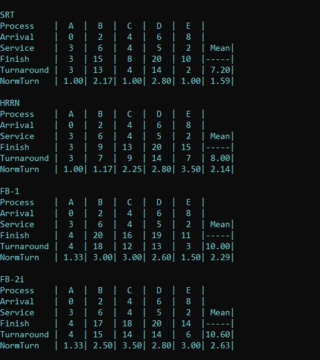

# Scheduling-Policies
A program to analyze, and visualize different CPU Scheduling  algorithms. 

## User Manual
type "make" to make the file

type "./prog" to run the program

### How to use the program
Line1. “trace” or “stats”.
“trace” is used to ask your program to visualize the processes switching over the CPU.
“stats” is used to ask your program to write some statistics on the scheduled processes.

Line2. a comma-separated list telling which CPU scheduling policies to be analyzed/visualized along with their parameters, if applicable. 
Each algorithm is represented by a number as listed in the introduction section and as shown in the attached testcases. 
Round Robin and Aging have a parameter specifying the quantum q to be used. Therefore, a policy entered as 2-4 means Round Robin with q=4. Also, policy 8-1 means Aging with q=1.

Line3. An integer specifying the last instant to be used in your simulation and to be shown on the timeline. 

Line4. An integer specifying the number of processes to be simulated. None of the processes is making a 
blocking call.

Line5. Start of description of processes. Each process is to be described on a separate line. For algorithms 
1 through 7, each process is described using a comma-separated list specifying:
- One character specifying a process name
- Arrival Time
For algorithm 8, each process is described using a comma-separated list specifying:
- One character specifying a process name
- Arrival Time
- Priority

ex:
enter the following as input to use the aging policy:
trace
8-1
20
2
A,0,2
B,2,4

ex:
stats
5
20
5
A,0,3
B,2,6
C,4,4
D,6,5
E,8,2

#### or you can simply redirect the output of file to be an input to the program as follows:
cat lab4-initial-testcases-v7/06b-input.txt | ./prog

ex:
cat lab4-initial-testcases-v7/10a-input.txt | ./prog

ex:
cat lab4-initial-testcases-v7/10b-input.txt | ./prog

